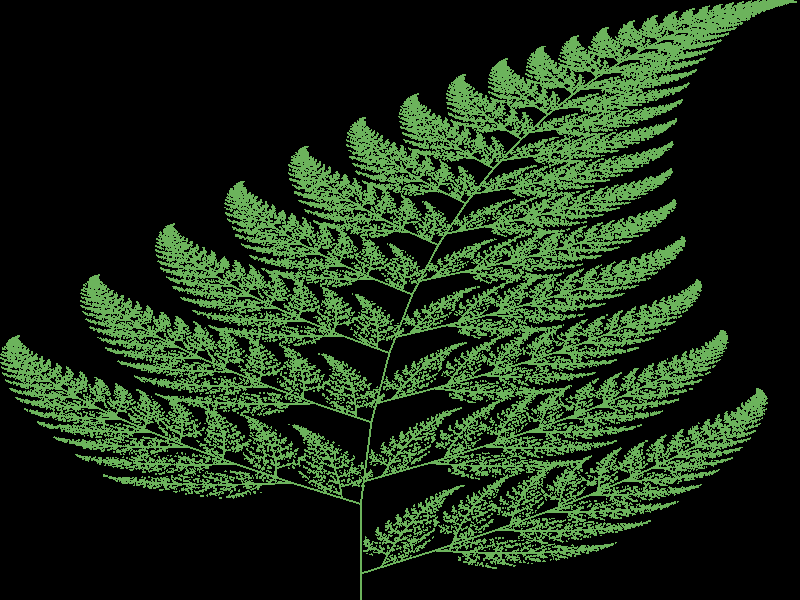

# Luaf
Is a implementation of the [Barnsley fern](https://en.wikipedia.org/wiki/Barnsley_fern).  
This implementation is made with lua and uses love2d for rendering.

## Dependencies
[LÖVE](https://love2d.org/)

## Usage

Metod 1:
- Create an [executable](https://love2d.org/wiki/Game_Distribution) with the contents of the directory 'src'.  

Metod 2:
- Execute the comand `love .` inside the 'src' directory.
